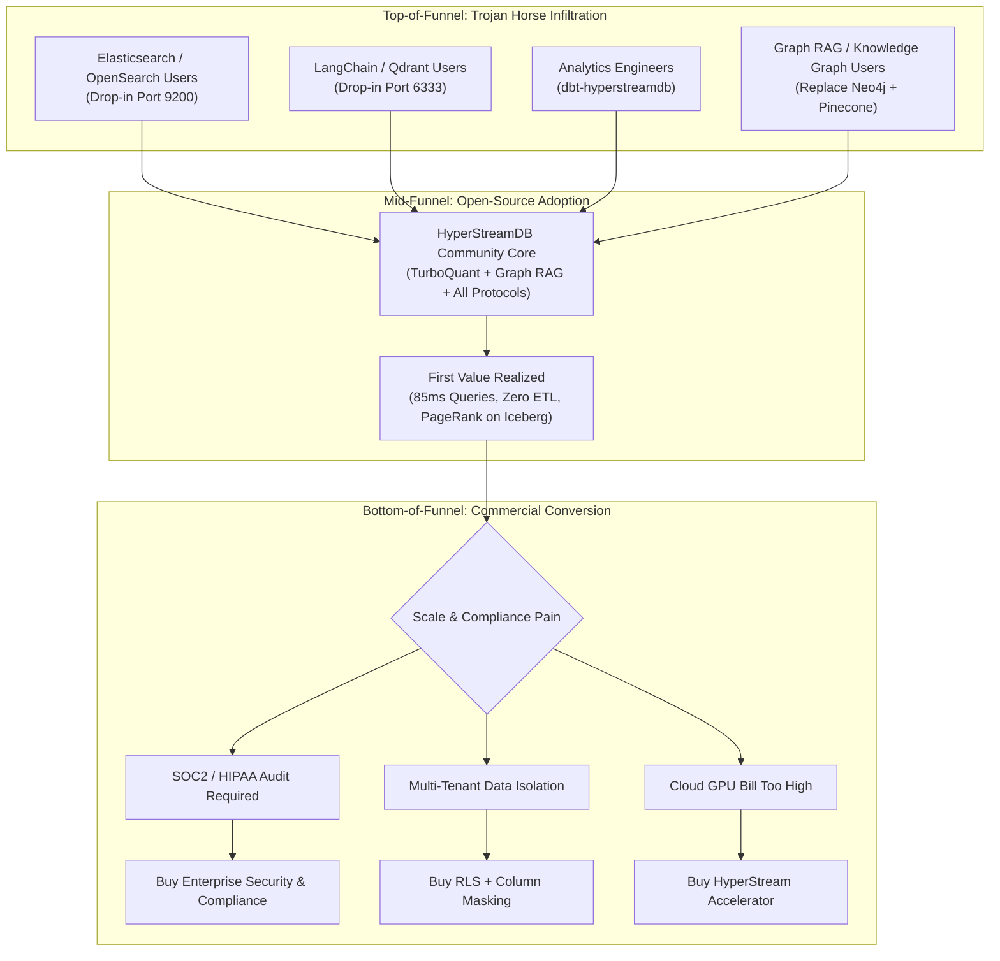

# HyperStreamDB: Commercialization, Monetization & Go-To-Market (GTM) Strategy

**Document Status:** Executive Architecture & Business Plan  
**Version:** 2.0 (Market-Validated)  
**Target Horizon:** 2026–2027  
**Author:** Antigravity / Engineering & Product Steering  
**Last Updated:** 2026-09-08  

---

## 1. Executive Summary & Market Dislocation

The modern data and AI infrastructure stack is suffering from severe architectural fragmentation and cost inflation:

1. **The Vector Database Silo Tax**: Dedicated vector databases (Pinecone, Milvus, Qdrant, Weaviate) require copying massive volumes of text and embeddings out of object storage into dedicated, always-on compute clusters with expensive RAM and NVMe SSDs ($5,000 – $50,000+/month).
2. **The Lakehouse Scan Tax**: Open data lake formats (Apache Iceberg, Delta Lake) excel at batch analytics but lack secondary index structures. Point lookups, high-selectivity filtering, and vector similarity queries require costly multi-gigabyte Parquet table scans.
3. **The Elasticsearch / OpenSearch Sprawl**: Organizations maintain brittle, JVM-heavy Elasticsearch clusters alongside their data lake just to achieve sub-second text and keyword filtering.

```
┌─────────────────────────────────────────────────────────────────────────┐
│                    THE ARCHITECTURAL DISLOCATION                        │
├───────────────────────────────────┬─────────────────────────────────────┤
│  TRADITIONAL SILOED APPROACH      │     HYPERSTREAMDB APPROACH          │
├───────────────────────────────────┼─────────────────────────────────────┤
│ • Primary Data: S3 Iceberg Tables │ • Single Source of Truth: S3/GCS/Az │
│ • Vector Silo: Pinecone / Qdrant  │ • Persistent Sidecars: HNSW + BM25  │
│ • Search Silo: Elasticsearch 7.10 │ • Multi-Protocol Gateway: In-place  │
│ • ETL Pipelines: Airflow / Kafka  │ • Zero Data Duplication             │
│ • Massive Monthly Cloud Invoices  │ • 10x Compute & Storage Cost Cut    │
└───────────────────────────────────┴─────────────────────────────────────┘
```

**HyperStreamDB's Positioning:**  
*HyperStreamDB is the serverless, index-streaming database engine with persistent sidecar indexing for Apache Iceberg.* It brings the speed of in-memory vector databases and the text search of Elasticsearch directly to object storage without creating secondary data silos.

---

## 2. Core Moat & Defensibility

HyperStreamDB possesses three compounding structural advantages:

1. **Zero Data Duplication (Sidecar Architecture)**:  
   Index files (`.idx` Roaring Bitmaps, `.inv.parquet` string inverted indexes, `.hnsw` vector graphs) live directly alongside Parquet data in S3/GCS. Query engines prune partitions and segments before reading a single Parquet split.
2. **Multi-Protocol Gateway Ecosystem**:  
   - **Arrow Flight SQL Gateway (`hyperstreamdb-flight`)**: Zero-copy Arrow streaming for ADBC, JDBC, ODBC, and BI tools.
   - **Dual Search Gateway (`hyperstreamdb-search`)**: Drop-in OpenSearch / Elasticsearch 7.10 REST (Port 9200) and Qdrant REST (Port 6333).
   - **Official dbt Adapter (`dbt-hyperstreamdb`)**: Native vector distance macros and partition-looping incremental materializations.
   - **Spark & Trino Connectors (`spark-hyperstream`, `trino-hyperstream`)**: JNI FFI bridges with native GPU pushdown.
3. **Cloud-Agnostic Concurrency (`FileBasedLock`)**:  
   Zero vendor lock-in. Concurrency is handled uniformly via atomic object store CAS (`PutMode::Create`) with heartbeats and leases, running seamlessly across AWS S3, Google Cloud Storage, Azure Blob, and MinIO.

---

## 2.1 The Competitive Landscape: Four Threat Vectors

HyperStreamDB competes across four distinct product categories in data infrastructure:

```
┌────────────────────────────────────────────────────────────────────────────────────────────────────────┐
│                                 THE VECTOR & SEARCH COMPETITIVE LANDSCAPE                              │
├────────────────────────┬────────────────────────────────┬──────────────────────────────────────────────┤
│ CATEGORY               │ KEY PLAYERS                    │ HOW HYPERSTREAMDB WINS                       │
├────────────────────────┼────────────────────────────────┼──────────────────────────────────────────────┤
│ 1. Disk & Lakehouse-   │ • LanceDB                      │ Open Iceberg/Parquet standard vs. bespoke    │
│    Adjacent Engines    │ • Turbopuffer                  │ formats (.lance) or closed proprietary SaaS. │
├────────────────────────┼────────────────────────────────┼──────────────────────────────────────────────┤
│ 2. Dedicated "Pure-    │ • Pinecone, Qdrant,            │ Zero data silos: S3 sidecars vs. $5k–$50k/mo │
│    Play" Vector Silos  │   Milvus, Weaviate, Chroma     │ hot RAM/NVMe clusters; Qdrant wire drop-in.  │
├────────────────────────┼────────────────────────────────┼──────────────────────────────────────────────┤
│ 3. Search & Database   │ • Elasticsearch / OpenSearch   │ Scale-to-zero Rust serverless vs. JVM heap   │
│    Incumbents          │ • pgvector (PostgreSQL)        │ crashes; petabyte scale vs. pg RAM limits.   │
├────────────────────────┼────────────────────────────────┼──────────────────────────────────────────────┤
│ 4. Big Cloud           │ • Databricks Vector Search     │ Multi-cloud & format neutrality vs. locked-in│
│    Lakehouse Giants    │ • Snowflake Cortex Search      │ DBU consumption and proprietary credits.     │
└────────────────────────┴────────────────────────────────┴──────────────────────────────────────────────┘
```

### Threat Category Breakdown:

#### 1. Disk & Lakehouse-Adjacent Engines
* **Turbopuffer**: Proves that serverless vector search directly on AWS S3 and NVMe is fast and viable. However, Turbopuffer is a **closed-source proprietary SaaS** where customer data must leave their VPC, and it completely lacks Apache Iceberg, Trino, Spark, or dbt integration.
* **Vespa (Yahoo)**: Battle-tested hybrid search engine with deep tensor rankers, but requires brutal operational complexity, custom C++ schemas, and heavy multi-node cluster management.

#### 2. Dedicated "Pure-Play" Vector Silos
* **Pinecone**: The SaaS pioneer. Sells convenience at exorbitant cost ($5,000–$50,000+/month). Requires duplicate ETL pipelines to keep data synchronized from S3.
* **Qdrant & Milvus**: High-performance vector engines. Milvus is notoriously complex to deploy (requires Kafka/Pulsar, etcd, MinIO). Qdrant is an exceptional vector engine—which is why **HyperStreamDB emulates Qdrant's REST wire protocol on Port 6333**, allowing Qdrant users to migrate without modifying client code.
* **Chroma**: Excellent for local Python prototyping, but struggles with large-scale multi-node concurrency and enterprise governance.

#### 3. Search & Database Incumbents
* **Elasticsearch / OpenSearch**: The enterprise standard for keyword search. Added vector search, but requires massive JVM heaps (32GB+ RAM per node), suffers from GC pauses, and costs thousands per month in idle compute. **HyperStreamDB emulates Elasticsearch 7.10 on Port 9200**, eliminating the JVM overhead entirely.
* **pgvector (PostgreSQL)**: The default starting point for developers. Hits severe performance and cost walls above 5M–10M vectors due to RAM constraints and Write-Ahead Log (WAL) amplification during index builds.

#### 4. The Lakehouse Giants
* **Databricks Vector Search & Snowflake Cortex Search**: Offer vector search over their respective proprietary platforms (Delta Lake and Snowflake internal tables). They charge high consumption markup (DBUs and credits) and enforce strict platform lock-in.

---

## 2.2 Deep Teardown: HyperStreamDB vs. LanceDB ("The Format Trap")

LanceDB is our most visible mindshare competitor in the "serverless/embedded disk-native vector database" category. However, LanceDB made a critical architectural gamble that creates HyperStreamDB's sharpest enterprise wedge: **The Format Trap**.

```
┌─────────────────────────────────────────────────────────────────────────────┐
│                    LANCEDB vs. HYPERSTREAMDB ARCHITECTURE                   │
├──────────────────────────────────────┬──────────────────────────────────────┤
│  LANCEDB: The Format Rewrite Trap    │  HYPERSTREAMDB: Native Iceberg Standard│
├──────────────────────────────────────┼──────────────────────────────────────┤
│ • Custom file format (.lance)        │ • Standard: Apache Iceberg V2/V3     │
│ • Forces full data rewrite & ETL     │ • Zero data rewrite (Sidecar Overlay)│
│ • Black box to enterprise catalogs   │ • Governed by Glue, Polaris, Unity   │
│ • Custom Python/Node client bindings │ • Multi-Protocol: Flight SQL, dbt, ES│
│ • Separate silo from lakehouse stack │ • Reads alongside Parquet in-place   │
└──────────────────────────────────────┴──────────────────────────────────────┘
```

### Why HyperStreamDB Wins the Enterprise Battle against LanceDB:
1. **No Data Rewrites (The Sidecar Advantage)**:
   LanceDB requires companies to ingest their data into `.lance` files. For an enterprise with hundreds of terabytes in S3, migrating to `.lance` is an operational non-starter. HyperStreamDB leaves Parquet files untouched and simply generates persistent sidecar indexes (`.hnsw`, `.idx`, `.inv`) in the same object storage bucket.
2. **Respect for the Winning Standard (Iceberg)**:
   Enterprises spent billions standardizing on Apache Iceberg to prevent vendor lock-in. LanceDB is attempting to replace Parquet with `.lance`. HyperStreamDB embraces Iceberg V2/V3, supporting snapshot isolation, sort orders, partition evolution, and catalog integration.
3. **The Protocol Advantage**:
   LanceDB requires using their proprietary client SDKs. HyperStreamDB provides **zero-code-change drop-in emulation**:
   - Drop-in for **Elasticsearch 7.10 (Port 9200)** for document & BM25 search.
   - Drop-in for **Qdrant (Port 6333)** for unstructured vector payloads.
   - Drop-in for **Arrow Flight SQL (Port 50051)** for zero-copy analytical SQL.
   - Official **`dbt-hyperstreamdb` adapter** for pure SQL vector feature engineering.

**Our Core Marketing Counter to LanceDB:**  
> *"LanceDB asks you to rewrite your lakehouse into a new, unproven file format (`.lance`). HyperStreamDB keeps your data in 100% standard Apache Iceberg Parquet files and gives you 10x faster vector and text search using persistent sidecar indexes."*

---

## 2.3 The Master Competitive Moat Matrix

| Competitor | Their Angle | Why Customers Leave / Hesitate | HyperStreamDB's Winning Wedge |
| :--- | :--- | :--- | :--- |
| **LanceDB** | Embedded disk-native vector DB | Proprietary `.lance` format forces full data rewrites | **Native Iceberg V2/V3 + Parquet sidecars (zero rewrite)** |
| **Turbopuffer** | S3-native serverless vector API | Closed SaaS, data leaves VPC, no lakehouse integration | **Open-source / VPC deployable, native to Iceberg stack** |
| **Pinecone** | Managed vector pioneer | Ridiculous cost at scale, creates isolated data silos | **10x cheaper in-place S3 search without data movement** |
| **Qdrant** | Rust vector database | Vector-only silo, does not speak SQL or Iceberg | **Emulates Qdrant wire protocol (Port 6333) over Iceberg** |
| **Elasticsearch** | Enterprise search standard | JVM memory hog, complex clustering, high idle cost | **Emulates ES 7.10 (Port 9200) in Rust, scale-to-zero** |
| **pgvector** | Relational vector extension | Cannot scale to petabyte data lakes without high RAM | **Lakehouse-scale O(1) sidecars on object storage** |
| **Databricks** | Managed lakehouse search | High DBU credit pricing, proprietary Delta lock-in | **Vendor-neutral, multi-cloud Iceberg core** |

---

## 3. Market-Validated Feature Monetization Strategy

### 3.1 Feature Viability: Competitive Reality Check (September 2026)

Before defining the commercial package, we audited every proposed enterprise feature against what the competitive landscape ships for free. The results require a fundamentally different packaging strategy than a naive "gate everything" approach.

```
┌──────────────────────────────────────────────────────────────────────────────┐
│                    FEATURE VIABILITY MATRIX (SEPT 2026)                       │
├─────────────────────────────────┬─────────┬──────────────────────────────────┤
│ FEATURE                         │ VERDICT │ RATIONALE                        │
├─────────────────────────────────┼─────────┼──────────────────────────────────┤
│ Security / RLS / Column Masking │ 🟢 SELL │ Universally gated behind paid    │
│                                 │         │ tiers at Pinecone, Qdrant, Milvus│
├─────────────────────────────────┼─────────┼──────────────────────────────────┤
│ Cryptographic Audit Logging     │ 🟢 SELL │ Enterprise-only at every vendor; │
│                                 │         │ required for SOC2/HIPAA signoff  │
├─────────────────────────────────┼─────────┼──────────────────────────────────┤
│ Fused GPU / SIMD Kernels        │ 🟢 SELL │ Engineering effort moat; nobody  │
│                                 │         │ ships Iceberg-specific kernels   │
├─────────────────────────────────┼─────────┼──────────────────────────────────┤
│ Autopilot (Compaction Daemon)   │ 🟡 WEAK │ Basic compaction is free at      │
│                                 │         │ Qdrant, Milvus, Weaviate; must   │
│                                 │         │ differentiate on 3-format aware  │
├─────────────────────────────────┼─────────┼──────────────────────────────────┤
│ Streaming WAL (Sub-10ms)        │ 🟡 WEAK │ Architecturally incompatible w/  │
│                                 │         │ Iceberg commit model; redesign   │
├─────────────────────────────────┼─────────┼──────────────────────────────────┤
│ TurboQuant™ (TQ4/TQ8 Quant.)   │ 🔴 FREE │ FWHT+SQ is ICLR 2026 public     │
│                                 │         │ research; shipped free by Qdrant,│
│                                 │         │ Milvus, LanceDB, Elastic         │
├─────────────────────────────────┼─────────┼──────────────────────────────────┤
│ Catalog Mesh (Two-Way Sync)     │ 🔴 FREE │ Commoditized by Apache Polaris   │
│                                 │         │ (graduated Feb 2026) and Iceberg │
│                                 │         │ REST spec; Horizon ships it free │
└─────────────────────────────────┴─────────┴──────────────────────────────────┘
```

### 3.2 The Honest Monetization Principle

> *"We give away the best open-source Iceberg vector engine for free — including TurboQuant, all catalogs, and all protocols. We charge for the security, compliance, and operational automation that lets you run it in production at Fortune 500 scale."*

**Why this works:** The developer community has zero tolerance for paywalled algorithms that competitors ship for free. Gating TurboQuant or catalog support would make HyperStreamDB *less* competitive, not more. The features enterprises actually write six-figure checks for are security, compliance, and operational risk reduction — precisely where no open-source vector DB delivers.

---

## 3.3 Commercial Feature Details

### 🟢 Pillar 1: Enterprise Security & Compliance (PRIMARY REVENUE DRIVER)

This is the **#1 purchase trigger** in enterprise data infrastructure. Every major competitor (Pinecone, Qdrant, Milvus, Weaviate) gates security behind paid tiers. The market has validated this model.

#### Feature A: Sidecar-Level Row-Level Security (RLS) & Multi-Tenancy
* **What makes it unique**: Because HyperStreamDB queries hit sidecar indexes (`.idx`, `.hnsw`) *before* touching Parquet, tenant isolation is enforced at the **index scan layer** via bitmap intersection — not at the query result layer. No competitor does this.
* **Implementation**: Intersect tenant-scoped Roaring Bitmap filters directly in the sidecar index path, ensuring Parquet reads never even see rows outside the caller's tenant scope.
* **Target Buyer**: CISO / Enterprise Architect / VP of Data Platform.
* **Value Pitch**: *"Tenant isolation enforced before a single Parquet byte is read."*

#### Feature B: Dynamic Column Masking
* **What makes it unique**: No vector-first engine offers automatic PII redaction (SSN, credit cards, emails) based on caller identity/role on vector query results. PostgreSQL has masking via extensions, but no Iceberg or vector-native engine does.
* **Compliance alignment**: HIPAA Safe Harbor, GDPR Article 25 (Data Protection by Design).

#### Feature C: Customer-Managed Encryption Keys (CMEK)
* **Standard enterprise requirement**: Envelope encryption for sidecar indexes using AWS KMS, GCP Cloud KMS, or HashiCorp Vault.
* **Competitive validation**: Pinecone charges for this. Qdrant charges for this.

#### Feature D: Cryptographic Audit Logging & Lineage
* **What makes it unique**: Append-only, tamper-evident cryptographic hash chain recording every Flight SQL query, `_search` request, user identity, execution latency, and retrieved document/record IDs — across **all three protocols** (Port 9200, 6333, 50051). No competitor has multi-protocol audit because no competitor runs three protocols.
* **SIEM Export**: Native export to Splunk, Datadog, AWS CloudWatch, and Snowflake.
* **Cross-catalog governance propagation**: When sidecar indexes are registered across multiple catalogs (Polaris, Unity, Glue), RLS policies and audit events propagate consistently.
* **Target Buyer**: Compliance & Security Engineering / SOC2 Auditors.
* **Value Pitch**: *"Complete non-repudiation audit trails for AI and SQL data access. Pass your SOC2 Type II audit without building custom logging infrastructure."*

---

### 🟢 Pillar 2: HyperStream Accelerator (COST-REDUCTION SELL)

The value here is NOT the quantization algorithms (those are free). The value is **specialized systems engineering that cuts the customer's cloud bill in half** on the same workload.

#### Feature E: Fused SIMD & Tensor Core Kernels
* **What's monetized**: Hand-crafted AVX-512, ARM SVE, and NVIDIA Hopper/Blackwell FP8/FP4 fused tensor kernels optimized specifically for HyperStreamDB's sidecar distance computation patterns.
* **Why this has value**: Generic libraries (cuVS, faiss) don't understand HyperStreamDB's three-file format. Fused kernels that pipeline sidecar bitmap intersection → quantized distance → Parquet column fetch are 3–5x faster than calling generic library functions sequentially.
* **Target Buyer**: Head of AI / Chief Data Scientist / Cloud FinOps.
* **Value Pitch**: *"Run your 1 billion embedding workload on 2 nodes instead of 8."*

#### Feature F: GPUDirect Storage Bypass
* **What's monetized**: Bypasses host CPU memory entirely, streaming sidecar indexes directly from NVMe/S3 local cache into GPU VRAM via NVIDIA GDS.
* **Why this has value**: Eliminates the PCIe copy bottleneck that caps throughput for GPU-accelerated vector search. Nobody else in the Iceberg ecosystem offers this.

#### Feature G: Iceberg Sidecar Lifecycle Manager (Evolved Autopilot)
* **Why basic compaction is NOT monetizable**: Qdrant, Milvus, and Weaviate all ship automatic segment compaction for free. A simple "auto-compact" daemon is table stakes in 2026.
* **What IS monetizable**: HyperStreamDB uniquely manages **three file formats simultaneously** — Iceberg manifests, Parquet data files, and sidecar indexes (`.hnsw`, `.idx`, `.inv`). The Sidecar Lifecycle Manager provides:
  - **Three-format coordination**: Synchronized compaction of Parquet bin-packing, sidecar index merging, and Iceberg snapshot cleanup in a single atomic operation.
  - **HNSW graph drift detection**: Monitors recall degradation as new vectors are ingested and triggers targeted graph layer rebalancing without full rebuilds.
  - **Cloud cost-aware scheduling**: Understands S3/GCS PUT/GET/LIST pricing to minimize API costs during compaction (e.g., batching small sidecar merges to reduce LIST calls).
  - **OCC-safe execution**: Performs compaction within the `FileBasedLock` + OCC framework, ensuring zero interference with concurrent query readers.
* **Target Buyer**: VP of Data Platform / Lead Data Engineer.
* **Value Pitch**: *"Eliminate 100% of Iceberg + sidecar maintenance toil. The only compaction engine that understands Parquet, HNSW, and Roaring Bitmaps together."*

---

### 🟢 Pillar 3: Team Codebase Lakehouse & CI Synchronization (TEAMS & DEVELOPER SEATS)

This captures recurring subscription revenue from engineering teams using AI coding agents (Cursor, Claude Desktop, Roo Code, Windsurf, Continue) who need fast, shared repository intelligence without paying for dedicated vector database clusters.

#### Feature H: Remote Cloud Object Storage Gatekeeper
* **What's monetized**: Activation of remote cloud object storage protocols (`s3://`, `gs://`, `az://`, `r2://`) for codebase indexing.
* **Community vs. Paid boundary**:
  * **Community (Free Forever)**: Unlimited local disk (`file://`) and developer MinIO (`http://localhost:9000`) for individual developers indexing local codebases on their machines.
  * **Team (Paid)**: Connecting `hyperstream-mcp` and CI indexers to remote cloud buckets requires a team license key (`HYPERSTREAM_LICENSE_KEY`).
* **Target Buyer**: VP of Engineering / Head of DevOps / Lead Platform Architect.
* **Value Pitch**: *"Zero-infrastructure codebase RAG for your entire team. No 24/7 Pinecone or Qdrant cluster required; serverless over S3."*

#### Feature I: Git-Diff Incremental CI Indexer (`hyperstreamdb/index-action@v1`)
* **What's monetized**: Official GitHub Actions, GitLab CI, and Jenkins integration that executes incremental AST parsing and embedding over git diffs (`--diff-since HEAD~1`).
* **Why this has value**:
  * Eliminates 99% of embedding API token costs by embedding modified files once per commit rather than each developer re-embedding locally.
  * Completes in **2 to 8 seconds** per PR, writing append-only Parquet chunks and Roaring Bitmap tombstones to S3.
* **Target Buyer**: Staff DevOps Engineer / Developer Experience (DevEx) Lead.
* **Value Pitch**: *"Embed every commit once for the whole company in 5 seconds. Save thousands per month on redundant LLM embedding tokens."*

#### Feature J: Centralized Team Knowledge Cache
* **What's monetized**: Zero-wait local cache synchronization from the S3 lakehouse down to engineers' local MCP servers.
* **Why this has value**: When a new engineer clones a 1,000,000-line repository, their AI assistant has 100% architectural context on minute one without running a 45-minute local indexing process.
* **Target Buyer**: Engineering Managers / Onboarding Leads.

---

### 🔴 Features Moved to Free Tier (Developer Acquisition)

The following features were originally planned as paid but are now **free in the Community Edition** based on competitive analysis:

#### TurboQuant™ (TQ4 / TQ8 Quantization) → FREE
* **Reason**: TurboQuant (FWHT + scalar quantization) was published as Google Research (ICLR 2026). The algorithm is public domain knowledge. Qdrant ships it free in v1.18. Milvus ships RaBitQ free in v2.6. LanceDB integrates RaBitQ for free. Elastic ships BBQ (RaBitQ-based) for free.
* **Strategic value as free**: TurboQuant becomes a **developer acquisition magnet** — "the only open-source Iceberg engine with state-of-the-art quantization built in." This is how we win against LanceDB and pgvector in developer mindshare.

#### All Catalogs (REST, Glue, Hive, Unity, Nessie, Polaris) → FREE
* **Reason**: Apache Polaris graduated as a top-level Apache project (Feb 2026). Catalog federation is being commoditized by the Iceberg REST specification itself. Snowflake Horizon ships bidirectional catalog sync as part of its base platform, not as a separate line item. Gating catalog support would actively harm adoption.
* **Two-way sync**: Basic metadata sync with Iceberg REST catalogs is free. Cross-catalog **governance propagation** (RLS policy sync, audit event federation) remains in the Enterprise Security package.

#### Micro-Batch Streaming Ingest → FREE
* **Reason (redesigned)**: The original "sub-10ms WAL" claim was architecturally incompatible with Iceberg's batch-oriented commit model. Instead, the free tier includes a **micro-batch streaming buffer** that converts Kafka/Kinesis event streams into Iceberg snapshots with pre-built sidecar indexes every 5–30 seconds.
* **Why free**: Qdrant, Milvus, and Weaviate all ship sub-second write-to-read latency with built-in WAL for free. HyperStreamDB's honest latency floor is 5–30 seconds (Iceberg commit cycle), which is competitive for lakehouse use cases but not for sub-millisecond fraud detection.

#### Graph RAG & Lakehouse Graph Analytics → FREE
* **Reason**: Graph RAG is the hottest pattern in the RAG ecosystem (Microsoft Graph RAG reference implementation is open source). PageRank, community detection, and neighborhood retrieval are well-known algorithms — gating them while Neo4j Community Edition offers graph algorithms for free would hurt adoption.
* **What's included free**: All graph SQL functions (`PAGERANK`, `COMMUNITY_DETECT`, `GRAPH_NEIGHBORS`, `NODE_SIMILARITY`, `CONNECTED_COMPONENTS`, `DEGREE_CENTRALITY`), Graph RAG search (`GRAPH_RAG_SEARCH` with local and global modes), Python graph API (`table.pagerank()`, `table.communities()`, `table.to_networkx()`), and dbt graph macros.
* **Why this is a massive differentiator**: No Iceberg-native engine offers graph analytics. No vector database (Qdrant, Milvus, LanceDB, Pinecone) offers PageRank or community detection. Today, Graph RAG requires Neo4j + Pinecone (two separate systems, two data copies). HyperStreamDB does entity graphs, community detection, and vector search in a **single Iceberg table with sidecars**.
* **Enterprise revenue pathway**: Graph features naturally feed into existing paid pillars — RLS on graph edges (Enterprise Security), audit logging on graph queries (Enterprise Security), GPU-accelerated PageRank on billion-edge graphs (Enterprise Accelerator). No new pricing tier needed.

---

## 4. Product Packaging & Tiering (Open Core)

HyperStreamDB follows an **Open Core + Commercial Enterprise + Managed Cloud** model:

| Capability | **Community (Open Source)**<br>*Apache 2.0 / MIT* | **Enterprise Edition**<br>*Proprietary License (VPC / On-Prem)* | **HyperStream Cloud**<br>*Fully Managed SaaS / BYOC* |
| :--- | :--- | :--- | :--- |
| **Table Format** | Apache Iceberg V2 & V3 | Apache Iceberg V2 & V3 + Encrypted Sidecars | Apache Iceberg V2 & V3 Managed |
| **Storage Backends** | S3, GCS, Azure Blob, Local FS | S3, GCS, Azure Blob, MinIO, Ceph, Dell ECS | Fully Managed S3/GCS or BYOC |
| **Core Indexes** | RoaringBitmap, Inverted, HNSW-IVF | RoaringBitmap, Inverted, HNSW-IVF | RoaringBitmap, Inverted, HNSW-IVF |
| **Quantization** | **TurboQuant™ (TQ4 / TQ8 with FWHT)** | **TurboQuant™ (TQ4 / TQ8 with FWHT)** | **TurboQuant™ (TQ4 / TQ8 with FWHT)** |
| **Graph Analytics** | **PageRank, Community Detection, Graph RAG, Neighborhood Retrieval** | **All + GPU-accelerated graph computation** | **All + Managed graph pipelines** |
| **Hardware (Baseline)** | WGPU (Metal, Vulkan, XPU) + CUDA | WGPU + CUDA | Auto-detected Managed GPU/CPU fleet |
| **Hardware (Accelerator)** | — | **Fused AVX-512 + Hopper/Blackwell Tensor Cores + GPUDirect Storage** | **Fused kernels + GPUDirect (Managed)** |
| **Query APIs** | DataFusion SQL, Flight SQL, REST | DataFusion SQL, Flight SQL, REST, Trino/Spark | Serverless Flight SQL & REST |
| **Catalogs** | **All: REST, Glue, Hive, Unity, Nessie** | **All + Cross-catalog governance sync** | **All + Managed catalog federation** |
| **Ecosystem** | `dbt-hyperstreamdb`, Python bindings | `dbt-hyperstreamdb`, Spark/Trino JNI Pushdown | Full ecosystem + Web Console & UI |
| **Concurrency** | `FileBasedLock` (CAS) + OCC | `FileBasedLock` (CAS) + OCC | Managed Distributed Lock Service |
| **Compaction** | Manual CLI (`hdb compact`) | **Sidecar Lifecycle Manager (3-format aware)** | 100% Autonomous, Background SLA |
| **Streaming Ingest** | **Micro-batch (5–30s Iceberg snapshots)** | Micro-batch + tunable latency | Real-time managed ingest pipeline |
| **Codebase RAG & MCP** | **Local MCP Server (stdio/SSE) + Local FS/MinIO (Free)** | **Remote S3/GCS Sync + Central Team Cache + CI Indexer** | **Managed Team Code Intelligence Hub** |
| **Security** | Standard catalog credentials | **Row-Level Security (RLS) + CMEK + Column Masking** | **RBAC, SSO/SAML, SCIM, CMEK** |
| **Auditing** | Application stdout tracing | **SOC2 Cryptographic Access Audit Log + SIEM** | Managed Audit Log & SIEM Integrations |
| **Support** | Community Discord & GitHub Issues | 24/7 Enterprise SLA, Designated Support Eng | 99.95% Uptime SLA + 24/7 Dedicated Support |
| **License** | **Apache 2.0 / MIT (Free Forever)** | **Annual Commercial Subscription** | **Consumption-Based (Pay-As-You-Go)** |

---

## 5. Pricing Models & Unit Economics

### A. Enterprise Edition (Self-Hosted in Customer's VPC / Air-Gapped)

**Pricing Metric**: Per managed TB of sidecar indexes, with optional Accelerator add-on.

**Tier 1: Enterprise Security & Compliance** — $25,000 – $80,000 / year
* Row-Level Security (RLS) with sidecar-level tenant bitmap isolation
* Dynamic Column Masking (PII redaction by role)
* Customer-Managed Encryption Keys (CMEK)
* Cryptographic Audit Logging (tamper-evident hash chains)
* SIEM Export (Splunk, Datadog, CloudWatch)
* Cross-catalog governance propagation
* Priority support SLA (8×5 or 24×7)

**Tier 2: HyperStream Accelerator** — $15,000 – $40,000 / year (add-on)
* Fused SIMD / Tensor Core kernels (AVX-512, Hopper FP8/FP4)
* GPUDirect Storage bypass (NVMe → GPU VRAM)
* Iceberg Sidecar Lifecycle Manager (autonomous 3-format compaction)
* Hardware-specific kernel auto-tuning

**Bundle: Enterprise Complete** — $35,000 – $100,000 / year
* Security & Compliance + Accelerator
* Dedicated Support Engineer
* Quarterly architecture reviews

### B. HyperStream Cloud (Serverless BYOC Control Plane)
* **Pricing Metric**: Value-aligned consumption model:
  * **Storage & Index Management**: $0.05 per GB of indexed data / month.
  * **Compute Runtime**: $0.20 per Query Engine vCPU-hour; $1.50 per GPU-hour (scaled to zero when idle).
  * **Security & Compliance features**: Included in all paid tiers.

### C. Team Codebase Intelligence Subscription (Developer Seats / Repo)
* **Pricing Metric**: Seat-based or Repository-based subscription for engineering teams using Cursor, Roo Code, Claude Desktop, and Windsurf:
  * **Team Seat Tier**: **$19 / developer / month** (includes unlimited cloud S3/R2 repos).
  * **Repository Flat Tier**: **$99 / repository / month** (unlimited developers per repo).
* **What's included**:
  * Direct synchronization of `hyperstream-mcp` to remote S3, GCS, Cloudflare R2, and Azure Blob.
  * Access to the official `hyperstreamdb/index-action@v1` GitHub Action & Jenkins CI runner.
  * Single CI-pass embedding: one PR embed serves 50+ developers with zero duplicated OpenAI/Voyage token costs.
  * Instant new developer onboarding (zero-second local repository indexing).

### D. Cost Comparison: HyperStreamDB vs. Status Quo

| Workload (50M 768D Embeddings + 500GB Text) | Status Quo Stack | HyperStreamDB (Free + Enterprise) | **Customer Savings** |
| :--- | :--- | :--- | :--- |
| **Vector Search** | Pinecone Enterprise: **$4,800/mo** | S3 Storage + TQ4 (Free): **$120/mo** | **97% Savings** |
| **Text & Keyword Search** | OpenSearch 3-node cluster: **$1,900/mo** | `hypersearch` scale-to-zero: **$280/mo** | **85% Savings** |
| **ETL & Data Sync** | Airflow + Kafka sync jobs: **$800/mo** | In-place Iceberg sidecars: **$0** (No ETL) | **100% Savings** |
| **Enterprise License** | N/A (separate vendor) | Enterprise Security: **$2,500/mo** | — |
| **Total Annual Cost** | **$90,000 / year** | **$34,800 / year** (incl. Enterprise license) | **$55,200 Net Annual Savings** |

---

## 6. Go-To-Market (GTM) Strategy & Marketing Engine



### Channel 1: The "Drop-In Proxy" Trojan Horse (Ports 9200 & 6333)
* **The Pitch**: *"Change your host URL from `search-cluster.internal:9200` to `hyperstream:9200`. Cut your OpenSearch AWS bill by 80% without modifying a single line of application code."*
* **Target Audience**: Developers struggling with OpenSearch / Elasticsearch JVM heap crashes and high AWS managed service invoices.
* **Frictionless Entry**: Developers download the single binary or Docker container and test against real data in 3 minutes.
* **Free Tier Strength**: TurboQuant quantization included free — developers get state-of-the-art compression from day one.

### Channel 2: The dbt Community Playbook (`dbt-hyperstreamdb`)
* **The Pitch**: *"Transform your Iceberg Lakehouse into a Vector Database using pure SQL in dbt."*
* **Target Audience**: Over 50,000 analytics engineers who already use dbt but are excluded from building RAG pipelines because traditional vector databases require Python/microservice infrastructure.
* **Campaign**:
  - Release ready-to-run dbt packages: `dbt-hyperstreamdb-rag` showcasing vector distance models, cosine similarity joins, and partition-looping incremental materializations.

### Channel 3: "Benchmark Warfare" Technical Marketing
* Developers distrust marketing claims; they respect reproducible, open-source benchmarks.
* **The Action**: Execute the existing [`benchmarks/competitive/benchmark_es710.py`](file:///home/ralbright/projects/hyperstreamdb/benchmarks/competitive/benchmark_es710.py) against a standard AWS OpenSearch cluster and publish an unvarnished technical whitepaper:
  - *"How We Replaced an 8-Node OpenSearch Cluster with S3 Sidecar Indexing and Rust"*
  - Key metrics to highlight: **753K rows/sec ingest**, **85ms p99 query**, and **14ms projected column search**.

### Channel 4: Target Buyer Personas & Messaging

| Persona | Primary Pain Point | Core Value Message | Conversion Trigger |
| :--- | :--- | :--- | :--- |
| **GenAI / AI Engineer** | Pinecone is too expensive; embeddings duplicate S3 data. | *"Search vectors directly in your S3 Iceberg data files with free TurboQuant GPU acceleration."* | Hitting Pinecone monthly quota or credit card limit. |
| **Data Platform Architect** | Complex pipelines synchronizing S3 to OpenSearch and Milvus. | *"One data format (Iceberg). Secondary indexes live in S3. Zero sync pipelines."* | Pipeline failures and data sync drift bugs. |
| **Graph RAG / Knowledge Graph Engineer** | Running Neo4j + Pinecone for Graph RAG is expensive and requires duplicating data across two systems. | *"PageRank, community detection, and vector search on the same Iceberg table. Replace two systems with one."* | Neo4j license renewal or Graph RAG prototype hitting production scale. |
| **CISO / Compliance Lead** | SOC2 audit requires per-query audit trails; current vector DB has none. | *"Tamper-evident cryptographic audit logs across all three query protocols. Pass SOC2 without building custom infrastructure."* | SOC2 Type II audit preparation deadline. |
| **VP of Engineering / CTO** | Exploding cloud compute bills across fragmented data stores. | *"Consolidate search, vector similarity, graph analytics, and lakehouse into one serverless engine. Enterprise security when you need it."* | Annual cloud budget review & cost-reduction mandate. |

---

## 7. 90-Day Execution Roadmap

```
Day 1 - 30: Technical GTM & Proof (FREE TIER STRENGTH)
├── 1. Move TurboQuant to free Community edition; update packaging
├── 2. Run & publish 100k / 1M doc benchmarks vs. Elasticsearch 7.10
├── 3. Launch single-command Docker Quickstart on Docker Hub & GitHub
└── 4. Publish launch article on Hacker News, Reddit r/dataengineering, and LinkedIn

Day 31 - 60: Developer Flywheel & Ecosystem Expansion
├── 1. Publish dbt-hyperstreamdb to PyPI with verified documentation
├── 2. Release LangChain & LlamaIndex vector store integrations using Port 6333
├── 3. Implement Graph SQL UDFs (PAGERANK, COMMUNITY_DETECT, GRAPH_NEIGHBORS)
├── 4. Implement micro-batch streaming ingest buffer (5-30s Iceberg snapshots)
├── 5. Host virtual workshop: "Building Zero-Silo Vector Search on Apache Iceberg"
└── 6. Publish Graph RAG tutorial: "Replace Neo4j + Pinecone with One Iceberg Table"

Day 61 - 90: Commercial Packaging & First Paid POCs (SECURITY-LED)
├── 1. Build sidecar-level Row-Level Security (RLS) with tenant bitmap isolation
├── 2. Implement cryptographic audit logging with SIEM export prototype
├── 3. Package Enterprise Security & Compliance tier with license keys
├── 4. Reach out to 15 mid-market companies in regulated industries (fintech, healthcare)
└── 5. Close 2 design partners on paid commercial POC agreements ($25,000 ARR each)
```

---

## 8. Conclusion

HyperStreamDB is positioned at the exact convergence of three massive secular trends in software infrastructure: **the universal adoption of Apache Iceberg as the standard table format**, **the explosion of enterprise vector & semantic search workloads**, and **the rise of Graph RAG as the dominant knowledge retrieval pattern for enterprise AI**.

The commercialization strategy is grounded in a market-validated reality: **algorithms are free, but production-grade security and operational automation are not.** Quantization techniques (TurboQuant, RaBitQ) have been commoditized — every major vector database ships them at no cost. Graph algorithms (PageRank, community detection) are well-known and belong in the free tier as developer acquisition tools. The features that enterprises actually write six-figure checks for are **SOC2/HIPAA compliance (audit logs, RLS, CMEK)**, **multi-tenant data isolation**, and **infrastructure cost reduction through specialized hardware kernels**.

By maintaining the most generous open-source free tier in the Iceberg vector search space — including TurboQuant, Graph RAG, all catalogs, all protocols, and micro-batch streaming — HyperStreamDB maximizes developer adoption. By monetizing **enterprise security & compliance** and **hardware acceleration engineering**, HyperStreamDB captures the high-margin, sticky revenue that scales with enterprise production deployments.

**The competitive moat**: HyperStreamDB is the only engine where entity graphs, community structures, vector embeddings, and full-text search all live in the same Iceberg table with sidecar indexes. No data duplication. No Neo4j + Pinecone + Elasticsearch sprawl. One engine, one data format, enterprise-grade security when you need it.
