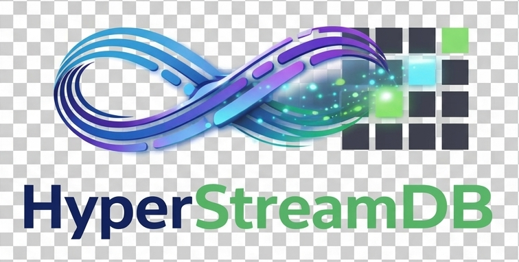

<p align="center">
  
</p>

# HyperStreamDB
**Serverless Index-Streaming Database with Overlay Indexing**

A production-ready indexed data lake format that combines the transactional guarantees of Apache Iceberg with persistent indexes (scalar bitmaps + HNSW vector search) for blazing-fast queries on object storage.

## 🎯 What Makes HyperStreamDB Different?

**HyperStreamDB = Iceberg + Persistent Indexes**

| Feature | Iceberg/Delta | HyperStreamDB |
|---------|---------------|---------------|
| **Transactional Updates** | ✅ Yes | ✅ Yes |
| **Time Travel** | ✅ Yes | ✅ Yes |
| **Scalar Indexes** | ❌ No | ✅ RoaringBitmap |
| **Boolean Indexes** | ❌ No | ✅ Native Boolean |
| **TurboQuant** | ❌ No | ✅ TQ8 & TQ4 (8-bit/4-bit) |
| **Fluent Indexing API** | ❌ No | ✅ Method Chaining |
| **Hybrid Queries** | ❌ No | ✅ Scalar + Vector |
| **Native SQL** | ❌ No | ✅ DataFusion |
| **Index-Optimized Joins** | ❌ No | ✅ Index Nested Loop |
| **Query Engines** | Spark/Trino | Spark/Trino/Python |

## ⚡ Iceberg V2/V3 Compliance

HyperStreamDB implements Apache Iceberg table format with full V2 and V3 feature support:

| Feature | V1 | V2 | V3 | HyperStreamDB |
|---------|----|----|----|--------------| 
| **Sort Orders** | ❌ | ✅ | ✅ | ✅ Implemented |
| **Partition Evolution** | ❌ | ✅ | ✅ | ✅ Implemented |
| **Statistics (NDV)** | ❌ | ✅ | ✅ | ✅ HyperLogLog |
| **Row Lineage** | ❌ | ❌ | ✅ | ✅ UUID + Sequence |
| **Default Values** | ❌ | ❌ | ✅ | ✅ Schema Fields |
| **Delete Files** | ❌ | ✅ | ✅ | ✅ Position + Equality |

### New APIs

```python
import hyperstreamdb as hdb

# Create table with sort order (V2)
table = hdb.Table("s3://bucket/table")
table.set_sort_order(["timestamp", "user_id"], ascending=[False, True])

# Evolve partition spec (V2)
table.set_partition_spec([
    {"source_id": 1, "field_id": 1000, "name": "date", "transform": "day"}
])

# V3 tables automatically include row lineage
# _row_id (UUID) and _last_updated_sequence_number are added when format_version >= 3
```

### Migration Guide: V2 → V3

Upgrading to V3 enables row-level operations and enhanced tracking:

1. **Automatic**: V3 metadata columns added transparently when `format_version >= 3`
2. **No Data Rewrite**: Existing data remains compatible
3. **New Columns**: `_row_id` (UUID v4), `_last_updated_sequence_number` (i64)


## 🚀 Quick Start

### Installation

**Standard Install (CPU + WGPU/Vulkan):**
The default package includes automatic high-performance hardware detection for Apple Metal, Intel Graphics/XPU, and AMD ROCm via **WGPU**.

```bash
pip install hyperstreamdb
```

**GPU Support:**
The standard package includes automatic detection for all hardware (NVIDIA CUDA, AMD ROCm, Intel XPU, and Apple Metal).

```bash
pip install hyperstreamdb
```

**Windows Users:**
HyperStreamDB is optimized for Linux/POSIX. Windows users should use **WSL2**.


### GPU Acceleration (Optional)

For GPU-accelerated vector operations, install the appropriate backend:

**NVIDIA CUDA:**
```bash
# Ubuntu/Debian
sudo apt-get install cuda-toolkit-12-3
# Verify: nvidia-smi
```

**AMD ROCm:**
ROCm support is now native on Linux via WGPU/Vulkan.
```bash
# Verify Vulkan support (standard in modern ROCm drivers)
vulkaninfo | grep vendor
# Verify: rocm-smi
```

**Apple Metal:**
- Included with macOS 12.3+ on Apple Silicon (M1, M2, M3, M4, M5)
- No additional installation required

**Intel XPU / Graphics:**
Intel Arc and Data Center GPUs are supported natively on Linux.
```bash
# Verify intel-media-va-driver or similar is present
clinfo | grep Intel
```

See [Python Vector API Documentation](docs/PYTHON_VECTOR_API.md) for detailed GPU setup instructions.

### pgvector SQL Compatibility

HyperStreamDB provides full pgvector-compatible SQL syntax for vector operations:

```sql
-- Use familiar pgvector operators
SELECT id, content, 
       embedding <-> '[0.1, 0.2, 0.3]'::vector AS l2_distance,
       embedding <=> '[0.1, 0.2, 0.3]'::vector AS cosine_distance
FROM documents
WHERE category = 'science'
ORDER BY l2_distance
LIMIT 10;

-- All six distance operators supported
-- <->  L2 (Euclidean)
-- <=>  Cosine  
-- <#>  Inner Product
-- <+>  L1 (Manhattan)
-- <~>  Hamming
-- <%>  Jaccard
```

See [pgvector SQL Guide](docs/PGVECTOR_SQL_GUIDE.md) for complete documentation.

### Basic Usage

```python
import hyperstreamdb as hdb

# Create table
table = hdb.Table("s3://bucket/my-table")

# Write data (Pandas/PyArrow)
import pandas as pd
df = pd.DataFrame({
    "id": [1, 2, 3],
    "embedding": [[0.1, 0.2], [0.3, 0.4], [0.5, 0.6]]
})
table.insert(df) # Convenient alias for write_pandas

# Create high-performance vector index (TQ8 - 4x compression)
table.add_index("embedding", "hnsw_tq8")

# Query with filters (uses indexes!) - Fluent API
results = table.query().filter("id > 1").execute()

# Vector search - Fluent API
query_vec = [0.15, 0.25]
results = table.query().vector_search(query_vec, column="embedding", k=10).execute()

# Hybrid query (scalar + vector) - Fluent API
results = (table.query()
                .filter("category = 'science'")
                .vector_search(query_vec, column="embedding", k=10)
                .execute())

# Alternative: Traditional API still supported
results = table.to_pandas(
    filter="category = 'science'",
    vector_filter={"embedding": query_vec, "k": 10}
)
```

## 🔄 Fluent Query API

HyperStreamDB features a modern fluent query API that supports method chaining for both Python and Rust:

### Python Fluent API

```python
import hyperstreamdb as hdb

table = hdb.Table("s3://bucket/my-table")

# Method chaining with filters
results = (table.query()
                .filter("age > 25")
                .filter("status = 'active'")  # Automatically combines with AND
                .execute())

# Vector search with fluent API
query_embedding = [0.1, 0.2, 0.3, 0.4]
results = (table.query()
                .vector_search(query_embedding, column="embedding", k=10)
                .execute())

# Combine scalar filtering with vector search
results = (table.query()
                .filter("category = 'documents'")
                .vector_search(query_embedding, column="content_vec", k=5)
                .select(['title', 'score'])
                .execute())

# Complex hybrid queries
results = (table.query()
                .filter("published_date > '2024-01-01'")
                .filter("author IN ('smith', 'jones')")
                .vector_search(query_embedding, column="embedding", k=20)
                .select(['title', 'author', 'score'])
                .execute())
```

### Rust Fluent API

The same fluent interface is available in native Rust:

```rust
use hyperstreamdb::{Table, VectorValue};

#[tokio::main]
async fn main() -> anyhow::Result<()> {
    let table = Table::new("s3://bucket/my-table")?;
    
    // Method chaining
    let results = table
        .query()
        .filter("age > 25")
        .vector_search("embedding", VectorValue::Float32(query_vec), 10)
        .select(vec!["name".to_string(), "score".to_string()])
        .to_batches()
        .await?;
    
    println!("Found {} result batches", results.len());
    Ok(())
}
```

### Benefits

- **Method Chaining**: Intuitive, readable query construction  
- **Type Safe**: Compile-time validation in Rust, runtime validation in Python
- **Performance**: Same underlying optimized execution as traditional APIs
- **Interoperable**: Mix with SQL queries and traditional `to_pandas()` calls
- **GPU Acceleration**: Automatic GPU context propagation for vector operations
- **TurboQuant Optimized**: Seamless integration with 8-bit/4-bit quantization

### TurboQuant Quantization (TQ8 / TQ4)

HyperStreamDB features **TurboQuant**, an optimized quantization engine that reduces vector storage costs while maintaining high search accuracy:

- **TQ8 (8-bit)**: 4x compression vs. float32. Near-lossless accuracy (typically >99% recall retention). Ideal for general-purpose RAG.
- **TQ4 (4-bit)**: 8x compression vs. float32. Maximum efficiency for massive datasets where storage cost is the primary bottleneck.

```python
# Use enterprise defaults (HNSW-TQ8)
table.add_index("embedding", "hnsw_tq8")

# High-compression mode
table.add_index("embedding", "hnsw_tq4")

# Custom HNSW-PQ configuration
table.add_index("embedding", {
    "type": "hnsw_pq",
    "complexity": 32,
    "quality": 300,
    "compression": 32 # PQ subspaces
})
```

### Python Vector Distance API with GPU Acceleration

HyperStreamDB provides a comprehensive Python API for vector distance computations with GPU acceleration:

```python
import hyperstreamdb as hdb
import numpy as np

# GPU-accelerated batch distance computation
ctx = hdb.GPUContext.auto_detect()  # Auto-detect CUDA/ROCm/Metal/XPU
print(f"Using GPU backend: {ctx.backend}")

# Create query and database vectors
query = np.random.randn(768).astype(np.float32)
database = np.random.randn(100000, 768).astype(np.float32)

# Compute distances on GPU (10x+ faster for large databases)
distances = hdb.l2_distance_batch(query, database, context=ctx)

# Find top-k nearest neighbors
k = 10
top_k_indices = np.argsort(distances)[:k]

# Single-pair distance computation
vec1 = np.array([1.0, 2.0, 3.0])
vec2 = np.array([4.0, 5.0, 6.0])
distance = hdb.cosine_distance(vec1, vec2)

# Sparse vector support for high-dimensional sparse data
sparse1 = hdb.SparseVector(
    indices=np.array([0, 5, 100], dtype=np.int32),
    values=np.array([1.0, 2.5, 0.8], dtype=np.float32),
    dim=1000
)
sparse2 = hdb.SparseVector(
    indices=np.array([5, 50, 100], dtype=np.int32),
    values=np.array([2.0, 1.5, 0.9], dtype=np.float32),
    dim=1000
)
distance = hdb.l2_distance_sparse(sparse1, sparse2)

# Binary vector operations (bit-packed for efficiency)
binary1 = np.packbits(np.random.randint(0, 2, 128))
binary2 = np.packbits(np.random.randint(0, 2, 128))
distance = hdb.hamming_distance_packed(binary1, binary2)
```

**Supported GPU Backends:**
- **CUDA** - NVIDIA GPUs (Linux, Windows via WSL2)
- **ROCm** - AMD GPUs (Native Linux via WGPU)
- **Intel XPU** - Intel Graphics (Native Linux via WGPU)
- **Metal (MPS)** - Apple Silicon (macOS)
- **Torch Alignment** - Automatically aliases `cuda` to `rocm` on AMD hardware if `torch.version.hip` is detected.
- **CPU** - Fallback for all platforms

**Supported Distance Metrics:**
- L2 (Euclidean), Cosine, Inner Product, L1 (Manhattan), Hamming, Jaccard

See [Python Vector API Documentation](docs/PYTHON_VECTOR_API.md) for complete API reference and GPU installation instructions

# SQL queries (full DataFusion support with pgvector syntax)
import hyperstreamdb as hdb
session = hdb.Session()
session.register("users", table)

# Optional: Enable GPU acceleration for SQL queries
ctx = hdb.GPUContext.auto_detect()
hdb.set_global_gpu_context(ctx)

# Simple SQL
results = table.sql("SELECT * FROM t WHERE id > 100")

# Vector similarity search with pgvector operators (GPU-accelerated)
results = session.sql("""
    SELECT id, content,
           embedding <-> '[0.1, 0.2, 0.3]'::vector AS distance
    FROM documents
    WHERE category = 'science'
    ORDER BY distance
    LIMIT 10
""")

# Joins (uses Index Nested Loop Join optimization)
results = session.sql("""
    SELECT u.name, o.amount
    FROM users u
    JOIN orders o ON u.id = o.user_id
    WHERE u.category = 'premium'
""")

# Maintenance
table.compact()
table.expire_snapshots(retain_last=10)
```

## 📊 Real-World Testing Plan

### Phase 1: Core Stability (Current)

**Test Datasets:**
- ✅ NYC Taxi (1.5B rows, ~200GB) - Scalar filtering
- ✅ Synthetic Embeddings (10M vectors, 768-dim) - Vector search
- 🔄 Wikipedia + Embeddings (100M docs) - Hybrid queries

**Download Test Data:**
```bash
# NYC Taxi dataset
./tests/data/download_nyc_taxi.sh

# Generate synthetic embeddings
python tests/data/generate_embeddings.py
```

**Run Benchmarks:**
```bash
# Rust benchmarks
cargo bench

# Integration tests
python tests/integration/test_nyc_taxi.py
```

  **Performance Targets:**
  - **Scalar Ingest**: >10K rows/sec ✅
  - **Vector Ingest (768D)**: >4,000 rows/sec ✅ (April 2026)
  - **Query (indexed)**: <100ms p99 ⏱️
  - **Vector search**: <50ms for k=10 on 10M vectors ⏱️
  - **Compaction**: <5min for 10GB ⏱️

  **Benchmarking Environment: Lenovo T480**
  - **System**: Lenovo T480
  - **CPU**: Intel(R) Core(TM) i5-8350U CPU @ 1.70GHz
  - **RAM**: 64GB
  - **OS**: Linux

  **Benchmarking Environment: Apple M4 Max**
  - **System**: MacBook Pro (M4 Max, 16-core CPU, 40-core GPU)
  - **Memory**: 128GB Unified Memory
  - **OS**: macOS (Arm64)
  - **Optimizations**: `target-cpu=native` (NEON SIMD)
  - **Results (100K vectors, 768D)**:
    - **Vector Ingest**: 16,707 rows/sec (CPU) ✅
    - **Vector Search (k=10)**: 819ms (CPU / NEON) ✅
    - **Vector Search (k=10)**: 860ms (MPS GPU) ⏱️

### Phase 2: Nessie Integration (Next)

**Catalog Strategy:**
- ✅ Use Nessie REST v2 (don't build custom catalog)
- Implement Rust client for Iceberg REST Catalog API
- Support Git-like branching for tables

**Why Nessie?**
- Iceberg-standard protocol
- Multi-table transactions
- Battle-tested (Netflix, Apple, Dremio)

### Phase 3: Production Hardening

- [ ] Schema evolution support
- [ ] Partition evolution
- [ ] Distributed locking (DynamoDB)
- [ ] CLI tools (`hyperstream compact`, `vacuum`)
- [ ] Prometheus metrics
- [ ] Error handling & retries

## 🏗️ Architecture

### Overlay Indexing

HyperStreamDB stores indexes as **sidecar files** alongside Parquet data:

```
s3://bucket/table/
├── data/
│   ├── segment_001.parquet                   # Main Data (Parquet)
│   ├── segment_001.id.inv.parquet           # Scalar index (Inverted Parquet)
│   ├── segment_001.emb.centroids.parquet    # Vector index centroids
│   └── segment_001.emb.cluster_0.hnsw.graph # Vector index graph (HNSW)
├── _manifest/
│   ├── v1.avro                              # Manifest (Iceberg/Avro)
│   └── v2.avro
└── _metadata/
    └── v1.metadata.json
```

### Manifest Format

**Apache Iceberg V2/V3 compliant** (Avro encoding):

```json
{
  "version": 2,
  "timestamp_ms": 1705512000000,
  "entries": [
    {
      "file_path": "segment_001.parquet",
      "file_size_bytes": 104857600,
      "record_count": 1000000,
      "index_files": [
        {
          "file_path": "segment_001.id.inv.parquet",
          "index_type": "scalar",
          "column_name": "id"
        },
        {
          "file_path": "segment_001.embedding.cluster_0.hnsw.graph",
          "index_type": "vector",
          "column_name": "embedding"
        }
      ]
    }
  ],
  "prev_version": 1
}
```

## 🔌 Connectors

### Spark
```scala
// Read
val df = spark.read
  .format("hyperstream")
  .option("path", "s3://bucket/table")
  .load()

// Write
df.write
  .format("hyperstream")
  .option("path", "s3://bucket/table")
  .save()
```

### Trino
```sql
SELECT * FROM hyperstream.default.my_table
WHERE id > 100;  -- Uses scalar index
```

### Python (Direct)
```python
# No Spark needed for local/notebook work
import hyperstreamdb as hdb
df = hdb.Table("s3://bucket/table").query().execute()
# Or using traditional API: df = hdb.Table("s3://bucket/table").to_pandas()
```

## 🔨 Building Connectors

The Spark and Trino connectors require building shaded "fat" JARs that bundle the native Rust core.

### Matrix Build
We provide a script to build a full matrix of connectors (Java 17/21, Spark 3.5/4.0):
```bash
./build-connectors.sh
```

### Hardware Acceleration
- **Standard**: Build with CPU + Intel Graphics/XPU support (default).
- **CUDA**: Build for NVIDIA GPUs:
  ```bash
  ./build-connectors.sh --cuda
  ```

### Portable Toolchain
The build script automatically downloads a project-local Maven and JDK 21 if they are missing from your system, ensuring a consistent build environment.

### Artifacts
Final JARs and ZIPs are collected in the `connector-artifacts/` directory.

## 🧪 Development

### Build & Test

```bash
# Build Rust library
cargo build --release

# Run tests
cargo test

# Run benchmarks
cargo bench

# Build Python bindings
maturin develop

# Python tests
pytest tests/
```

### Project Structure

```
hyperstreamdb/
├── src/
│   ├── lib.rs              # Main library
│   ├── segment.rs          # Hybrid segment writer
│   ├── reader.rs           # Index-aware reader
│   ├── manifest.rs         # Manifest management
│   ├── compaction.rs       # Compaction engine
│   ├── maintenance.rs      # Vacuum/GC
│   ├── python_binding.rs   # PyO3 bindings
│   └── storage.rs          # Multi-cloud storage
├── spark-hyperstream/      # Spark connector (Java)
├── trino-hyperstream/      # Trino connector (Java)
├── tests/
│   ├── data/               # Test datasets
│   ├── integration/        # Integration tests
│   └── benchmarks/         # Performance tests
└── benches/                # Criterion benchmarks
```

## 📈 Roadmap

### ✅ Completed
- [x] Hybrid segment format (Parquet + indexes)
- [x] Manifest management (Iceberg-like)
- [x] Compaction engine
- [x] Maintenance (expire_snapshots, remove_orphan_files)
- [x] Python bindings (Pandas-compatible)
- [x] Native SQL support (DataFusion integration)
- [x] pgvector-compatible SQL operators and syntax
- [x] Index Nested Loop Join optimization
- [x] Boolean column indexing
- [x] Multi-table JOIN support
- [x] Real-world testing (NYC Taxi, Wikipedia, embeddings)
- [x] Nessie catalog integration
- [x] Iceberg V2 compliance (Sort Orders, Partition Evolution, Statistics)
- [x] Iceberg V3 features (Row Lineage, Default Values, HyperLogLog NDV)
- [x] Standard Iceberg API (`update_spec`, `replace_sort_order`, `rewrite_data_files`, `rollback_to_snapshot`)
- [x] Python Vector Distance API with GPU acceleration
- [x] Multi-backend GPU support (CUDA, ROCm, Metal, XPU)
- [x] Sparse and binary vector operations

### 🔄 In Progress
- [ ] Spark/Trino connectors
- [ ] Schema evolution
- [ ] Partition evolution

### 📋 Planned
- [ ] Distributed locking (DynamoDB/Zookeeper)
- [ ] CLI tools (`hyperstream admin`)
- [ ] Prometheus metrics
- [ ] **REST Gateway** (OpenAPI for JS/Frontend RAG integration)

## 🤝 Contributing

We welcome contributions! See [CONTRIBUTING.md](CONTRIBUTING.md) for guidelines.

## 📄 License

The Python wrapper is licensed under the **MIT License**.
The underlying Rust engine and core database logic is licensed under the **Apache License 2.0**.

This project contains modified source code from various upstream open-source projects (including `hnsw_rs` for pre-filtering support), which were originally licensed under Apache 2.0. HyperStreamDB maintains compliance by retaining all original copyright notices and providing prominent notice of modifications in the relevant source files.

## 🙏 Acknowledgments

- **Apache Iceberg** - Inspiration for manifest design
- **Apache Arrow** - Columnar format
- **hnsw_rs** - Vector indexing
- **RoaringBitmap** - Scalar indexing

---

**Built with ❤️ in Rust**
