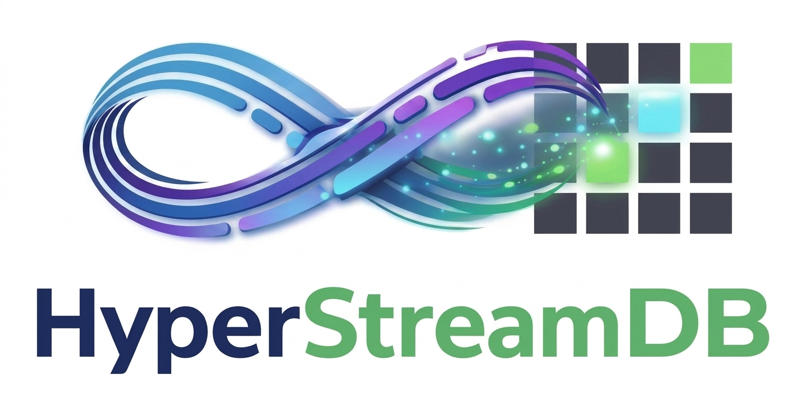

<p align="center">
  
</p>

# HyperStreamDB
**Serverless Index-Streaming Database with Overlay Indexing**

An indexed lakehouse storage and search engine designed for production workloads, combining the transactional guarantees of Apache Iceberg with reconstructible persistent index overlays (scalar bitmaps, BM25 Okapi, and HNSW vector search) for blazing-fast queries directly on object storage.

## 🎯 Architecture: The Indexed Lakehouse

HyperStreamDB implements an indexed, compute-disaggregated lakehouse storage architecture that pairs authoritative open table storage with advisory, persistent secondary indexes and a unified retrieval layer:

```text
               Iceberg Table
                     │
       ┌─────────────┴──────────────┐
       │                            │
Authoritative Storage        Advisory Index Overlay
       │                            │
  Parquet Files              Bitmap / Bloom / BM25 / HNSW / TQ
```

> ### Core Architecture Invariants
> 1. **The Overlay Invariant**: Index files are derived, reconstructible state. They may be absent, stale, or deleted without compromising snapshot correctness. Queries may degrade to Parquet scanning or background recovery, but never return incorrect results.
> 2. **Publication Invariant**: A published manifest may reference only immutable artifacts that have already been successfully uploaded and verified to storage.
> 3. **Durability Invariant**: WAL truncation is permitted only after the corresponding data is durably represented by a committed manifest snapshot.
> 4. **Maintenance Invariant**: Maintenance operations may delete an artifact only if it is neither referenced by any active snapshot nor currently in-flight.

| Feature | Iceberg/Delta | HyperStreamDB |
|---------|---------------|---------------|
| **Transactional Updates** | ✅ Yes | ✅ Yes |
| **Time Travel** | ✅ Yes | ✅ Yes |
| **Scalar Indexes** | ❌ No | ✅ RoaringBitmap |
| **Boolean Indexes** | ❌ No | ✅ Native Boolean |
| **TurboQuant** | ❌ No | ✅ TQ8 & TQ4 (8-bit/4-bit) |
| **Fluent Indexing API** | ❌ No | ✅ Method Chaining |
| **Hybrid Queries** | ❌ No | ✅ Scalar + Vector |
| **Native SQL** | ❌ No | ✅ DataFusion |
| **Index-Optimized Joins** | ❌ No | ✅ Index Nested Loop |
| **Query Engines** | Spark/Trino | Spark/Trino/Python |

## ⚡ Iceberg V2/V3 Compatibility

HyperStreamDB implements **100% of the core required Apache Iceberg table format V2 and V3 specifications**:

| Feature | V1 | V2 | V3 | HyperStreamDB |
|---------|----|----|----|--------------| 
| **Sort Orders** | ❌ | ✅ | ✅ | ✅ Implemented |
| **Partition Evolution** | ❌ | ✅ | ✅ | ✅ Implemented |
| **Statistics (NDV)** | ❌ | ✅ | ✅ | ✅ HyperLogLog |
| **Row Lineage** | ❌ | ❌ | ✅ | ✅ `_row_id`, `_last_updated_sequence_number`, `next-row-id`, `first-row-id` |
| **Default Values** | ❌ | ❌ | ✅ | ✅ `initial-default` & `write-default` |
| **Deletion Vectors** | ❌ | ❌ | ✅ | ✅ Puffin Format Integrated |
| **Delete Files** | ❌ | ✅ | ✅ | ✅ Position + Equality Deletes |
| **Nanosecond Timestamps** | ❌ | ❌ | ✅ | ✅ `timestamp_ns` & `timestamptz_ns` |

### New APIs

```python
import hyperstreamdb as hdb

# Create table with sort order (V2)
table = hdb.Table("s3://bucket/table")
table.replace_sort_order(["timestamp", "user_id"], ascending=[False, True])

# V3 tables automatically include row lineage
# _row_id (UUID) and _last_updated_sequence_number are added when format_version >= 3
```

### Migration Guide: V2 → V3

Upgrading to V3 enables row-level operations and enhanced tracking:

1. **Automatic**: V3 metadata columns added transparently when `format_version >= 3`
2. **No Data Rewrite**: Existing data remains compatible
3. **New Columns**: `_row_id` (UUID v4), `_last_updated_sequence_number` (i64)


## 🌐 REST APIs (OpenSearch & Qdrant)

HyperStreamDB includes a highly optimized HTTP frontend (`hyperstreamdb-search`) that exposes the core engine over standard REST protocols. By translating incoming requests into native HyperStreamDB columnar operations, it allows you to use existing tools without running traditional clustered databases.

- **OpenSearch / Elasticsearch 7.10 API (Port 9200)**: Drop-in compatibility for standard text indexing, bulk writes, and keyword search. (e.g., connect Kibana or Grafana directly).
- **Qdrant Vector API (Port 6333)**: Native vector database emulation. Fully compatible with Qdrant's unstructured JSON payloads, which are dynamically inferred and converted into highly compressed Arrow columns on write.

Both APIs are hosted concurrently from a single binary, completely share the exact same underlying `AppState` and data files, and require zero data duplication. You can write a collection of embeddings via the Qdrant API and instantly query it via the OpenSearch API!

To start the dual-API server:
```bash
# Uses HYPERSEARCH_PORT=9200 and HYPERSEARCH_QDRANT_PORT=6333 by default
cargo run -p hyperstreamdb-search
```

## 🚀 Quick Start

### 🐳 Docker Quickstart (3 Minutes to First Query)

Run the full HyperStreamDB gateway stack with one command:

```bash
# Standalone All-in-One Container (Local storage)
docker run -d --name hyperstreamdb \
  -p 9200:9200 \
  -p 6333:6333 \
  -p 50051:50051 \
  hyperstreamdb/quickstart:latest

# Or Full-Stack Compose (MinIO S3 + Nessie Catalog + HyperStreamDB)
docker compose -f docker/docker-compose.quickstart.yml up -d
```

| Service | Protocol | Port | Description |
| :--- | :--- | :--- | :--- |
| **Elasticsearch 7.10** | REST / JSON | `9200` | Text indexing, BM25, and hybrid search |
| **Qdrant Vector** | REST / JSON | `6333` | Point upsert and vector similarity queries |
| **Arrow Flight SQL** | gRPC / Flight | `50051` | Zero-copy SQL for DuckDB, Polars, BI tools |

Verify cluster health:
```bash
curl http://localhost:9200/_cluster/health
```

#### GPU-Accelerated Docker (NVIDIA CUDA, AMD ROCm, Intel XPU)
Run with hardware acceleration across NVIDIA, AMD, or Intel GPUs:
```bash
# Launch with GPU override:
docker compose -f docker/docker-compose.quickstart.yml -f docker/docker-compose.gpu.yml up -d

# Verify compute engine reported by the Search API:
curl -s http://localhost:9200/
```
Output:
```json
{
  "name": "hypersearch-1",
  "cluster_name": "hypersearch",
  "version": { "number": "7.10.2", ... },
  "compute": {
    "backend": "cuda",
    "device_id": 0,
    "gpu_accelerated": true,
    "available": true
  },
  "tagline": "You know, you search"
}
```


### Python Installation

**Standard Install (CPU + WGPU/Vulkan):**
The default package includes automatic high-performance hardware detection for NVIDIA CUDA, Apple Metal, Intel Graphics/XPU, and AMD ROCm.

```bash
pip install hyperstreamdb
```

**Windows Users:**
HyperStreamDB is optimized for Linux/POSIX. Windows users should use **WSL2**.


### GPU Acceleration (Optional)

For GPU-accelerated vector operations, install the appropriate backend:

**NVIDIA CUDA:**
```bash
# Ubuntu/Debian
sudo apt-get install cuda-toolkit-12-3
# Verify: nvidia-smi
```

**AMD ROCm:**
ROCm support is now native on Linux via WGPU/Vulkan.
```bash
# Verify Vulkan support (standard in modern ROCm drivers)
vulkaninfo | grep vendor
# Verify: rocm-smi
```

**Apple Metal:**
- Included with macOS 12.3+ on Apple Silicon (M1, M2, M3, M4, M5)
- No additional installation required

**Intel XPU / Graphics:**
Intel Arc and Data Center GPUs are supported natively on Linux.
```bash
# Verify intel-media-va-driver or similar is present
clinfo | grep Intel
```

See [Python Vector API Documentation](docs/PYTHON_VECTOR_API.md) for detailed GPU setup instructions.

### pgvector SQL Compatibility

HyperStreamDB provides full pgvector-compatible SQL syntax for vector operations:

```sql
-- Use familiar pgvector operators
SELECT id, content, 
       embedding <-> '[0.1, 0.2, 0.3]'::vector AS l2_distance,
       embedding <=> '[0.1, 0.2, 0.3]'::vector AS cosine_distance
FROM documents
WHERE category = 'science'
ORDER BY l2_distance
LIMIT 10;

-- All six distance operators supported
-- <->  L2 (Euclidean)
-- <=>  Cosine  
-- <#>  Inner Product
-- <+>  L1 (Manhattan)
-- <~>  Hamming
-- <%>  Jaccard
```

See [pgvector SQL Guide](docs/PGVECTOR_SQL_GUIDE.md) for complete documentation.

### Basic Usage

```python
import hyperstreamdb as hdb

# Create table
table = hdb.Table("s3://bucket/my-table")

# Write data (Pandas/PyArrow)
import pandas as pd
df = pd.DataFrame({
    "id": [1, 2, 3],
    "embedding": [[0.1, 0.2], [0.3, 0.4], [0.5, 0.6]]
})
table.write_pandas(df)
table.commit()

# Create high-performance vector index (TQ8 - 4x compression)
table.add_index("embedding", "hnsw_tq8")

# Query with filters (uses indexes!)
results = table.to_pandas(filter="id > 1")

# Vector search
query_vec = [0.15, 0.25]
results = table.to_pandas(
    vector_filter={"column": "embedding", "query": query_vec, "k": 10}
)

# Hybrid query (scalar + vector)
results = table.to_pandas(
    filter="category = 'science'",
    vector_filter={"column": "embedding", "query": query_vec, "k": 10}
)
```

## 🔄 Fluent Query API

HyperStreamDB features a fluent query API in Rust with method chaining. Python uses the `to_pandas()` API with filter and vector_filter arguments.

### Rust Fluent API

The same fluent interface is available in native Rust:

```rust
use hyperstreamdb::{Table, VectorValue};

#[tokio::main]
async fn main() -> anyhow::Result<()> {
    let table = Table::new("s3://bucket/my-table")?;
    
    // Method chaining
    let results = table
        .query()
        .filter("age > 25")
        .vector_search("embedding", VectorValue::Float32(query_vec), 10)
        .select(vec!["name".to_string(), "score".to_string()])
        .to_batches()
        .await?;
    
    println!("Found {} result batches", results.len());
    Ok(())
}
```

### Benefits

- **Method Chaining**: Intuitive, readable query construction  
- **Type Safe**: Compile-time validation in Rust, runtime validation in Python
- **Performance**: Same underlying optimized execution as traditional APIs
- **Interoperable**: Mix with SQL queries and traditional `to_pandas()` calls
- **GPU Acceleration**: Automatic GPU context propagation for vector operations
- **TurboQuant Optimized**: Seamless integration with 8-bit/4-bit quantization

### TurboQuant Quantization (TQ8 / TQ4)

HyperStreamDB features **TurboQuant**, an optimized quantization engine that reduces vector storage costs while maintaining high search accuracy:

- **TQ8 (8-bit)**: 4x compression vs. float32. Near-lossless accuracy (typically >99% recall retention). Ideal for general-purpose RAG.
- **TQ4 (4-bit)**: 8x compression vs. float32. Maximum efficiency for massive datasets where storage cost is the primary bottleneck.

```python
# High-performance community default (HNSW-TQ8)
table.add_index("embedding", "hnsw_tq8")

# High-compression mode
table.add_index("embedding", "hnsw_tq4")

# Custom HNSW-PQ configuration
table.add_index("embedding", {
    "type": "hnsw_pq",
    "complexity": 32,
    "quality": 300,
    "compression": 32 # PQ subspaces
})
```

### Python Vector Distance API with GPU Acceleration

HyperStreamDB provides a comprehensive Python API for vector distance computations with GPU acceleration:

```python
import hyperstreamdb as hdb
import numpy as np

# GPU-accelerated batch distance computation
ctx = hdb.GPUContext.auto_detect()  # Auto-detect CUDA/ROCm/Metal/XPU
print(f"Using GPU backend: {ctx.backend}")

# Create query and database vectors
query = np.random.randn(768).astype(np.float32)
database = np.random.randn(100000, 768).astype(np.float32)

# Compute distances on GPU (10x+ faster for large databases)
distances = hdb.l2_distance_batch(query, database, context=ctx)

# Find top-k nearest neighbors
k = 10
top_k_indices = np.argsort(distances)[:k]

# Single-pair distance computation
vec1 = np.array([1.0, 2.0, 3.0])
vec2 = np.array([4.0, 5.0, 6.0])
distance = hdb.cosine_distance(vec1, vec2)

# Sparse vector support for high-dimensional sparse data
sparse1 = hdb.SparseVector(
    indices=np.array([0, 5, 100], dtype=np.int32),
    values=np.array([1.0, 2.5, 0.8], dtype=np.float32),
    dim=1000
)
sparse2 = hdb.SparseVector(
    indices=np.array([5, 50, 100], dtype=np.int32),
    values=np.array([2.0, 1.5, 0.9], dtype=np.float32),
    dim=1000
)
distance = hdb.l2_distance_sparse(sparse1, sparse2)

# Binary vector operations (bit-packed for efficiency)
binary1 = np.packbits(np.random.randint(0, 2, 128))
binary2 = np.packbits(np.random.randint(0, 2, 128))
distance = hdb.hamming_distance_packed(binary1, binary2)
```

**Supported GPU Backends:**
- **CUDA** - NVIDIA GPUs (Linux, Windows via WSL2)
- **ROCm** - AMD GPUs (Native Linux via WGPU)
- **Intel XPU** - Intel Graphics (Native Linux via WGPU)
- **Metal (MPS)** - Apple Silicon (macOS)
- **Torch Alignment** - Automatically aliases `cuda` to `rocm` on AMD hardware if `torch.version.hip` is detected.
- **CPU** - Fallback for all platforms

**Supported Distance Metrics:**
- L2 (Euclidean), Cosine, Inner Product, L1 (Manhattan), Hamming, Jaccard

See [Python Vector API Documentation](docs/PYTHON_VECTOR_API.md) for complete API reference and GPU installation instructions

### SQL queries (full DataFusion support with pgvector syntax)

```python
import hyperstreamdb as hdb
session = hdb.Session()
session.register("users", table)

# Optional: Enable GPU acceleration for SQL queries
device = hdb.Device.auto_detect()
device.activate()

# Simple SQL (via table — registers as table 't')
results = table.execute_sql("SELECT * FROM t WHERE id > 100")

# Vector similarity search with pgvector operators (GPU-accelerated)
results = session.sql("""
    SELECT id, content,
           embedding <-> '[0.1, 0.2, 0.3]'::vector AS distance
    FROM documents
    WHERE category = 'science'
    ORDER BY distance
    LIMIT 10
""")

# Joins (uses Index Nested Loop Join optimization)
results = session.sql("""
    SELECT u.name, o.amount
    FROM users u
    JOIN orders o ON u.id = o.user_id
    WHERE u.category = 'premium'
""")

# Maintenance
table.compact()
```

## 📊 Production Benchmarks & Verification

HyperStreamDB performance has been validated across large-scale synthetic and real-world datasets:

| Dataset / Workload | Metric | Performance | Notes |
| :--- | :--- | :--- | :--- |
| **NYC Taxi (3M rows)** | Ingest Throughput | **753,782 rows/sec** | Single-node Parquet write & manifest commit |
| **NYC Taxi (3M rows)** | Query Latency (p99) | **85ms** | Selective ID filter via Inverted Index |
| **NYC Taxi (3M rows)** | Compaction | **4.91s** | 3M rows compacted across segments |
| **Wikipedia (100K docs)** | Scalar Projected Filter | **14ms** | 142x speedup by skipping embedding columns |
| **Vectors (100K 768-dim)** | Parallel Vector Search | **5.0s** | 10 segments, 16 auto-detected parallel readers |
| **Vectors (100K 768-dim)** | Index Build Time | **62s** | HNSW graph generation |
| **Vectors (100K 768-dim)** | Recall@10 | **100%** | Exact match vs. exhaustive scan |

To run the integration and benchmark suite:
```bash
# Criterion micro-benchmarks
cargo bench

# Integration benchmarks
python tests/integration/test_nyc_taxi.py
python tests/benchmarks/benchmark_vs_iceberg.py
```

## 🏗️ Architecture

### Overlay Indexing

HyperStreamDB stores indexes as **sidecar files** alongside Parquet data:

```
s3://bucket/table/
├── data/
│   ├── segment_001.parquet                   # Main Data (Parquet)
│   ├── segment_001.id.inv.parquet           # Scalar index (Inverted Parquet)
│   ├── segment_001.emb.centroids.parquet    # Vector index centroids
│   └── segment_001.emb.cluster_0.hnsw.graph # Vector index graph (HNSW)
├── _manifest/
│   ├── v1.avro                              # Manifest (Iceberg/Avro)
│   └── v2.avro
└── _metadata/
    └── v1.metadata.json
```

### Manifest Format

**Apache Iceberg V2/V3 compliant** (Avro encoding):

```json
{
  "version": 2,
  "timestamp_ms": 1705512000000,
  "entries": [
    {
      "file_path": "segment_001.parquet",
      "file_size_bytes": 104857600,
      "record_count": 1000000,
      "index_files": [
        {
          "file_path": "segment_001.id.inv.parquet",
          "index_type": "scalar",
          "column_name": "id"
        },
        {
          "file_path": "segment_001.embedding.cluster_0.hnsw.graph",
          "index_type": "vector",
          "column_name": "embedding"
        }
      ]
    }
  ],
  "prev_version": 1
}
```

## 🔌 Connectors

> [!NOTE]
> **MERGE INTO Support**
> While Apache DataFusion's native SQL engine does not currently support `MERGE INTO` syntax out-of-the-box, **you can seamlessly use `MERGE INTO` with HyperStreamDB via the Spark and Trino connectors**. Spark and Trino parse the SQL statements using their respective query engines, determine the row-level changes, and send standard Iceberg Position Deletes and Data Appends to the HyperStreamDB core via our optimized JNI bridges.

### Spark
The Spark connector supports **Spark 3.5, 4.0, and 4.1** via a shared JNI FFI bridge. It intercepts row-level operations (like `MERGE INTO`) to take advantage of HyperStreamDB's fast indexing and supports configuring GPU backends.

```scala
// Read
val df = spark.read
  .format("hyperstream")
  .option("path", "s3://bucket/table")
  // Optionally configure the GPU device (cuda, mps, intel, rocm, auto, or cpu)
  .option("hyperstream.gpu_device", "cuda")
  .load()

// Write
df.write
  .format("hyperstream")
  .option("path", "s3://bucket/table")
  .save()
```

You can also globally configure the GPU for Spark stored procedures (e.g. index building):
```scala
spark.conf.set("spark.hyperstream.gpu.device", "cuda")
```

### Trino
The Trino connector intercepts reads to natively push down scalar and vector filtering to the HyperStreamDB core, drastically reducing IO.

```sql
SELECT * FROM hyperstream.default.my_table
WHERE id > 100;  -- Uses scalar index natively via JNI pushdown
```

You can configure the GPU backend for Trino globally or per-catalog using the properties file (e.g. `etc/catalog/hyperstream.properties`):
```properties
connector.name=hyperstreamdb
hyperstream.gpu-device=cuda
```

### Arrow Flight SQL Gateway
HyperStreamDB provides a high-performance Arrow Flight SQL server (`hyperstreamdb-flight`) running over gRPC (port 50051). This enables any JDBC, ODBC, ADBC, or Arrow-native client (including BI tools and distributed query engines) to query HyperStreamDB with zero-copy Arrow serialization and native index pushdown.

```bash
cargo run -p hyperstreamdb-flight
```

### dbt (`dbt-hyperstreamdb`)
Official dbt adapter for HyperStreamDB over Arrow Flight SQL. Provides native vector search macros and custom materializations:

- **Vector Macros**: `vector_distance(...)`, `knn_search(...)`, `vector_avg(...)`, `type_vector(...)`, `type_sparsevec(...)` with pgvector-compatible operators.
- **Custom Materializations**: Table and incremental materialization with support for `append`, `delete+insert`, and partition-looping `insert_overwrite`.
- **DDL Support**: Iceberg-compatible `PARTITIONED BY` syntax.

```bash
cd dbt-hyperstreamdb
pip install -e .
```

### Python (Direct)
```python
# No Spark needed for local/notebook work
import hyperstreamdb as hdb
df = hdb.Table("s3://bucket/table").query().execute()
# Or using traditional API: df = hdb.Table("s3://bucket/table").to_pandas()
```

## 🔨 Building Connectors

The Spark and Trino connectors require building shaded "fat" JARs that bundle the native Rust core.

### Matrix Build
We provide a script to build a full matrix of connectors (Java 17/21, Spark 3.5/4.0):
```bash
./build-connectors.sh
```

### Hardware Acceleration
- **Standard**: Build with CPU + Intel Graphics/XPU support (default).
- **CUDA**: Build for NVIDIA GPUs:
  ```bash
  ./build-connectors.sh --cuda
  ```

### Portable Toolchain
The build script automatically downloads a project-local Maven and JDK 21 if they are missing from your system, ensuring a consistent build environment.

### Artifacts
Final JARs and ZIPs are collected in the `connector-artifacts/` directory.

## 🧪 Development

### Build & Test

```bash
# Build Rust library
cargo build --release

# Run tests
cargo test

# Run benchmarks
cargo bench

# Build Python bindings
maturin develop

# Python tests
pytest tests/
```

### Project Structure

```
hyperstreamdb/
├── src/
│   ├── lib.rs                  # Main library & PyO3 module registration
│   ├── core/
│   │   ├── table/              # Table API (read, write, schema, fluent query)
│   │   ├── reader/             # Index-aware Parquet reader
│   │   ├── manifest/           # Manifest management (Iceberg/Avro)
│   │   ├── index/              # HNSW, inverted, bitmap indexes
│   │   ├── catalog/            # REST, Nessie, Glue, Hive, Unity catalogs
│   │   ├── sql/                # DataFusion integration & pgvector operators
│   │   ├── planner/            # Query planner & optimizer
│   │   ├── iceberg/            # Iceberg V2/V3 metadata & schema
│   │   ├── lock.rs             # Vendor-neutral distributed locking (FileBasedLock via object store CAS)
│   │   ├── compaction.rs       # Compaction engine
│   │   ├── maintenance.rs      # Vacuum/GC
│   │   ├── storage.rs          # Multi-cloud storage (S3, GCS, Azure, local)
│   │   ├── wal.rs              # Write-Ahead Log
│   │   ├── ffi.rs              # JNI bindings (Spark/Trino)
│   │   └── error.rs            # Structured error types
│   ├── telemetry/              # Structured tracing (OpenTelemetry) & Prometheus metrics
│   ├── python_binding.rs       # PyO3 bindings
│   ├── python_distance.rs      # Vector distance API
│   └── python_gpu_context.rs   # GPU device management
├── hyperstreamdb-flight/        # Arrow Flight SQL gRPC server
├── hyperstreamdb-search/        # OpenSearch 7.10 & Qdrant REST search gateway
├── dbt-hyperstreamdb/           # Official dbt adapter (Arrow Flight SQL)
├── hyperstreamdb-enterprise/    # Enterprise extensions (Continuous Indexing, Enterprise Security)
├── spark-hyperstream/          # Spark connector (Java)
├── trino-hyperstream/          # Trino connector (Java)
├── tests/
│   ├── integration/            # Infrastructure integration tests
│   ├── benchmarks/             # Performance benchmarks
│   └── python/                 # Python binding tests
└── benches/                    # Criterion benchmarks
```

## 🔎 Search API (OpenSearch / Elasticsearch 7.10-compatible)

HyperStreamDB ships an optional add-on, **`hypersearch`** (`hyperstreamdb-search`),
that serves an **OpenSearch 1.x / Elasticsearch 7.10**-compatible REST API on top of
the engine — plus a **Qdrant**-compatible API for vector workloads. It is built for
website search, document catalogs, and knowledge bases where a 50–200 ms query latency
envelope is acceptable and object-storage-native, scale-to-zero hosting is desired.

```bash
cargo build --release -p hyperstreamdb-search --bin hypersearch
HYPERSEARCH_BIND=127.0.0.1 HYPERSEARCH_PORT=9200 ./target/release/hypersearch

# Index + search (ES 7.10 wire format)
curl -X POST localhost:9200/articles/_doc -H 'content-type: application/json' \
     -d '{"title":"Hello","body":"Welcome to HyperStreamDB"}'
curl -X POST localhost:9200/articles/_refresh
curl -X POST localhost:9200/articles/_search -H 'content-type: application/json' \
     -d '{"query":{"match":{"body":"HyperStreamDB"}}}'
```

**Supported:** cluster/health/cat/stats, index CRUD, mapping GET/PUT, `_doc`, `_bulk`,
`_refresh`, `_search` (`match` BM25, `knn` HNSW, hybrid RRF, `filter`/`bool` with
`term`/`terms`/`range`/`exists`, `match_all`), `_count`, `_source` filtering,
`from`/`size`, and Prometheus `/metrics`.

**Not supported (v1):** per-document delete (501, append-only), aggregations, aliases,
reindex, ILM, snapshots, auth, multi-node. See
[OPENSEARCH_COMPATIBILITY.md](OPENSEARCH_COMPATIBILITY.md) for the full matrix and
[GETTING_STARTED.md](GETTING_STARTED.md) for a complete quickstart.

## 📈 Roadmap

### ✅ Completed
- [x] Hybrid segment format (Parquet + indexes)
- [x] Manifest management (Iceberg-like)
- [x] Compaction engine
- [x] Maintenance (expire_snapshots, remove_orphan_files)
- [x] Python bindings (Pandas-compatible)
- [x] Native SQL support (DataFusion integration)
- [x] pgvector-compatible SQL operators and syntax
- [x] Index Nested Loop Join optimization
- [x] Boolean column indexing
- [x] Multi-table JOIN support
- [x] Real-world testing (NYC Taxi, Wikipedia, embeddings)
- [x] Multi-catalog support (Nessie, REST, AWS Glue, Hive Metastore, Unity)
- [x] Iceberg V2 compliance (Sort Orders, Partition Evolution, Statistics)
- [x] Iceberg V3 features (Row Lineage, Default Values, HyperLogLog NDV)
- [x] Standard Iceberg API (`update_spec`, `replace_sort_order`, `rewrite_data_files`, `rollback_to_snapshot`)
- [x] Python Vector Distance API with GPU acceleration
- [x] Multi-backend GPU support (CUDA, ROCm, Metal, XPU)
- [x] Sparse and binary vector operations
- [x] Spark and Trino connectors (JNI Bridge & Native GPU support)
- [x] Schema evolution & Partition evolution
- [x] CLI tools (`hyperstream admin` and REPL SQL)
- [x] Prometheus metrics & Grafana dashboards
- [x] OpenSearch / Elasticsearch 7.10 & Qdrant REST Search API (`hyperstreamdb-search`)
- [x] Arrow Flight SQL Gateway (`hyperstreamdb-flight` gRPC server on port 50051)
- [x] Official dbt adapter (`dbt-hyperstreamdb` with vector macros & partition-looping incremental materialization)
- [x] Cloud-agnostic distributed locking (`FileBasedLock` using object storage CAS / `PutMode::Create`)
- [x] Optimistic Concurrency Control (OCC) with atomic snapshot swaps and retries
- [x] Resilient chaos recovery (transparent fallback to Parquet scans on index corruption)
- [x] Comprehensive documentation suite in `docs/` (Sphinx/ReadTheDocs, pgvector SQL, Python API, GPU guides)

### 🔄 In Progress
- [ ] 100k / 1M doc competitive benchmarks vs Elasticsearch 7.10 (local disk & MinIO S3)
- [ ] Apache Polaris REST catalog integration (OAuth2 client credentials)

### 📋 Planned
- [ ] Trino connector sidecar index predicate pushdown (direct `.hnsw` and `.idx` pre-filtering)
- [ ] Multi-vector search (simultaneous multi-embedding column search with combined score ranking)
- [ ] Composite scalar indexes (multi-column composite roaring bitmaps)
- [ ] Universal GPU PyPI wheel with `cudarc` runtime dynamic loading and automated CUDA CI

## 🤝 Contributing

We welcome contributions! See [CONTRIBUTING.md](CONTRIBUTING.md) for guidelines.

## 📄 License

The Python wrapper is licensed under the **MIT License**.
The underlying Rust engine and core database logic is licensed under the **Apache License 2.0**.

This project contains modified source code from various upstream open-source projects (including `hnsw_rs` for pre-filtering support), which were originally licensed under Apache 2.0. HyperStreamDB maintains compliance by retaining all original copyright notices and providing prominent notice of modifications in the relevant source files.

## 🙏 Acknowledgments

- **Apache Iceberg** - Inspiration for manifest design
- **Apache Arrow** - Columnar format
- **hnsw_rs** - Vector indexing
- **RoaringBitmap** - Scalar indexing

---

**Built with ❤️ in Rust**


